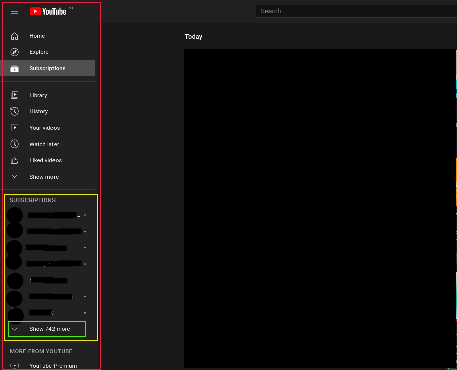

# sub-scraper
Scrapes your YouTube subscriptions into an XML file, usually for use in an RSS feed. 

## Table of Contents
* [Motivation](https://github.com/antidipyramid/sub-scraper#motivation)
* [Technologies](https://github.com/antidipyramid/sub-scraper#technologies)
* [How It Works](https://github.com/antidipyramid/sub-scraper#how-it-works)
* [Installation](https://github.com/antidipyramid/sub-scraper#installation)
* [Status](https://github.com/antidipyramid/sub-scraper#status)

## Motivation
Each YouTube channel has an associated RSS feed. YouTube used to offer users the ability to download an OPML file (an XML format used by RSS readers) of their subscriptions. Unfortunately, this functionality seems to have been removed. This script allows a logged in YouTube user to generate an OPML file of their subscriptions so that updates can be accessed using an RSS reader.

## Technologies
I used this as an opportunity to explore functional programming, so the script heavily utilizes the Ramda.js library.

## How It Works

1. On any YouTube page, when the user is logged in, there is an collapsible "drawer" on the left-hand side of the page (outlined in red).
2. In this drawer, there is an exapandable list of subscriptions (outlined in yellow). The script expands this list (using the button outlined in green) and extracts the channel link for each subscription.
3. In the past, all YouTube channels used a generic URL format plus a unique "channel ID." The channel ID continue to be valid but most channels now have simplified URLs corresponding to their account names (e.g. youtube[dot]com/AChannel or youtube[dot]com/c/AChannel).
4. The channel ID is accessible in the source of the channel's page so for each subscription, the script asynchronously fetches the channel page's source, extracts the channel ID, constructs the RSS links, then creates the OPML file for download.

## Installation
This script can be installed using a scripting extension such as Greasemonkey or Tampermonkey. 

## Status
In the future, I'd like to create a standalone browser extension using the WebExtensions API so that it can be installed across popular browsers.
